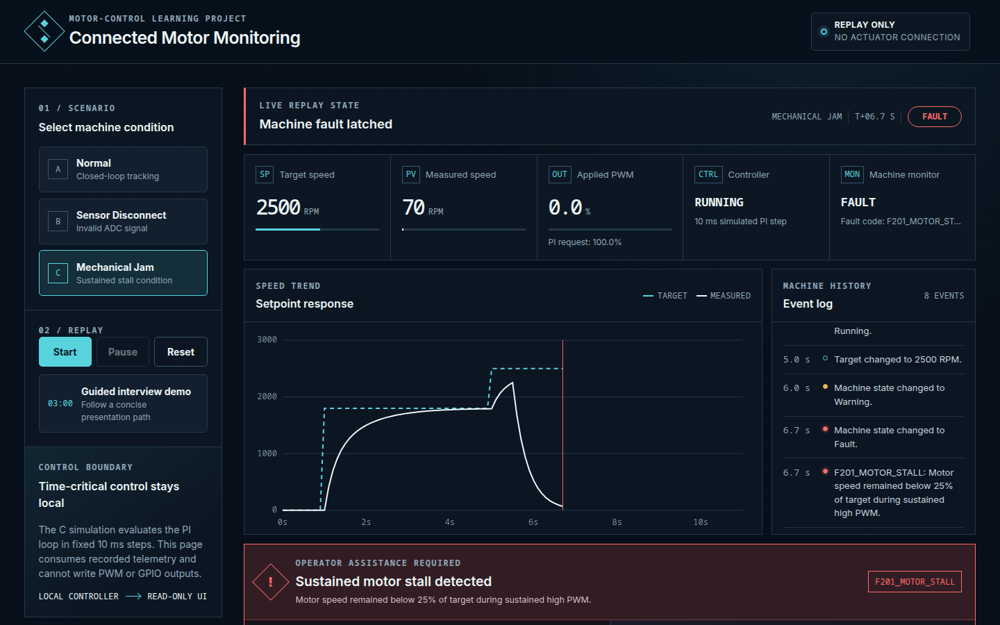

# Connected Motor Monitoring Demo

This is a learning project from my computer science studies at ELTE. It began as a small C exercise to practise feedback control, then grew to include three repeatable scenarios, machine-state monitoring, structured telemetry, and a browser dashboard that presents the result from an operator's point of view.

It is not connected to real hardware or Tulip, and it is not a safety system.



## What the demo shows

| Scenario | What happens |
| --- | --- |
| Normal | The motor follows target changes at 1,800, 2,500, and 1,200 RPM. |
| Sensor disconnect | At 5.5 s, an invalid speed input makes the controller request 0% PWM and the monitor latches `F101_SENSOR_SIGNAL_INVALID`. |
| Mechanical jam | At 5.5 s, the simulated load rises to 100%. Low speed and a high PI request produce a warning; after 750 ms the monitor latches `F201_MOTOR_STALL` and overrides the applied PWM to 0%. |

The dashboard replays telemetry generated by the C executable. Start, Pause, and Reset control playback only; the browser has no path to the simulated PWM or GPIO outputs.

## Build and run

Requirements: a C99 compiler and `make`.

```sh
make clean
make
make test
```

Run any scenario in a readable table:

```sh
./build/motor_control --scenario normal --format table
./build/motor_control --scenario sensor-disconnect --format table
./build/motor_control --scenario mechanical-jam --format table
```

JSON Lines and CSV are also available through `--format jsonl` and `--format csv`.

To open the dashboard locally:

```sh
make dashboard-data
python3 -m http.server 8000 --directory docs
```

Then visit <http://localhost:8000>. The dashboard uses local HTML, CSS, JavaScript, and committed telemetry; it needs no API key or external service.

## How it works

```text
Scenario -> fixed-step C simulation -> telemetry -> dashboard replay
                       |
                       +-> motor model / simulated HAL / PI controller / monitor override
```

- `motor_controller` converts valid 12-bit ADC readings to RPM and calculates proportional and integral terms.
- Conditional integration prevents the stored integral from growing farther into output saturation while still allowing it to unwind.
- `motor_model` uses a first-order response with a 0.35 s time constant. A load factor reduces its attainable steady-state speed.
- `machine_monitor` keeps warning/fault logic separate from the controller. Stall evidence must satisfy target, speed-ratio, PI-request, and time conditions.
- `simulation` advances synthetic time in fixed 10 ms steps. It does not claim real-time scheduling.
- `telemetry` distinguishes the PI controller's requested PWM from the PWM actually applied after a monitor stop.

The full component diagram is in [`docs/architecture.puml`](docs/architecture.puml).

## Fault behavior

The stall rule requires all of these conditions continuously:

- target at least 1,000 RPM;
- measured speed at or below 25% of target;
- PI request at least 70%; and
- 0.75 s elapsed since the first qualifying sample.

These values make the scenario easy to see; they were not commissioned for real machinery.

An out-of-range ADC value is rejected before control is calculated. Invalid speed data is carried as unavailable: JSON uses `null`, CSV leaves the field empty, and the table shows `--`.

Faults remain latched for the rest of a run. Reset starts a new simulation; it is not a model of a validated machine-reset procedure.

## Verification

The test executable contains 26 focused tests for:

- PI response, limits, integral reset, and anti-windup;
- invalid ADC, timing, configuration, and numeric inputs;
- simulated HAL and motor-model boundaries;
- scenario transition times and stall persistence;
- complete repeatable simulations; and
- telemetry fields, null measurements, and string escaping.

The default build treats C99 warnings as errors with `-Wall -Wextra -Wpedantic -Werror`.

## Limits and possible hardware path

The motor model omits current, torque, friction, electrical dynamics, sensor noise, thermal effects, and real safety circuits. The “jam” is a full-load disturbance, not a detailed mechanical model. Dashboard events and operator notes are not persisted.

Real hardware would need a motor driver, board-specific ADC or encoder and PWM code, scheduled execution, signal conditioning, protection, measured timing, calibration, commissioning, and independently designed safety functions. A gateway could publish slower telemetry to an operations platform such as Tulip for operator apps, records, and workflows; the time-sensitive controller and safety functions would remain local.

The dashboard's troubleshooting text is deterministic and selected from the current fault and a frozen telemetry snapshot. It is not a language model. The wording is adapted from the fictional examples in [`docs/troubleshooting-samples.md`](docs/troubleshooting-samples.md).

## AI use

AI was used to propose and implement parts of the project extension, including controller changes, tests, dashboard code, and documentation. Agent-assisted builds and tests pass; repository-owner review is still required. See [`AI_USAGE.md`](AI_USAGE.md) for details.
